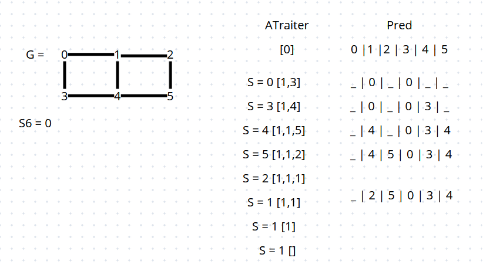
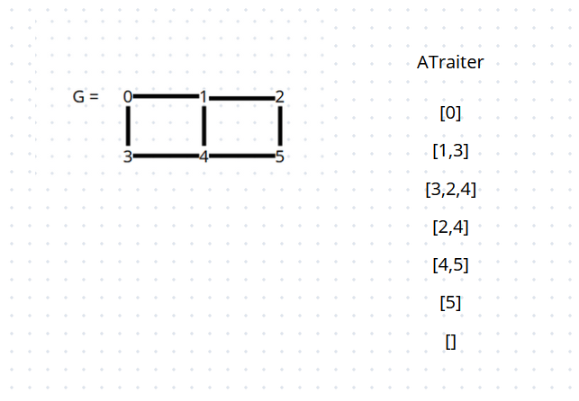
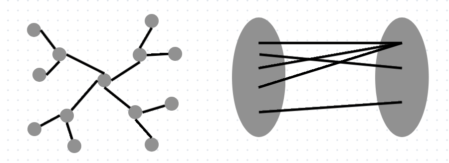

# INFO601 CM2
## Contenus
- [II. Parcours simples : Profondeur et largeur](#ii-parcours-simples--profondeur-et-largeur)
## Cours
### II. Parcours simples : Profondeur et largeur

De nombreux problèmes de graphes nécessitent un <ins>parcours</ins> de graphe : 
on parcourt les sommets en suivant des arêtes. 

Idée on part d'un sommet, on ajoute les voisin et on garde une "frontière"
entre les sommets vus et ceux non vus. On choisit un sommet
à la frontière et on continue.</br>
<ins>"algo"</ins> parcours simple à partir de s.</br>
```
Vu = vide
ATraiter = [s] #La frontière
while ATraiter non vide :
    s = CHOIX d'un élément de ATraiter (on l'enlève)
    if DEJA vu :
        continue
    AJOUTE dans vu
    for v in G[s] :
        if not v DEJA Vu :
            AJOUTE v dans ATraiter
```
<ins>Ex </ins> : parcours en profondeur (Python)
```
Vu = [False] * n
ATraiter = [s]
Prod = [None] * n 
while ATraiter : 
    s = ATraiter.pop()
    if Vu[s]:
        continue
    Vu[s] = True
    for v in G[s] :
        if not Vu(v]:
            ATraiter.append(v)
            Pred[v] = s
```
Sans données supplémentaires, ce parcours ne sert pas à grand chose. </br>
On ajoute souvent un tableau Prod[] qui sauvegarde chaque 
sommet, son "predecesseur" lors du parcours. </br>
 </br>
<ins>Complexité</ins> : Cet algorithme a une complexité au pire de cas de 0 (n+m). </br>

<ins>Variante</ins> : parcours en largeur</br> 
Dans le parcours en profondeur ATraiter est utilisé comme une pile.

Pour le parcours en largeur.
    - ATraiter est une file
    - On ne change pas le predecesseur (seule la paramètre arête compte)
```
Vu = [False] * n
ATraiter = [s]
Pred = [None] * n
while ATraiter :
    s = ATraiter.pop(0) 
    if Vo[s] :
        continue
     for v in G[s] :
        if not Vu[v] and Pred[v] != None :
            ATraiter.append(v)
            Pred[v] = s
```
 </br>
<ins> Proposition</ins> :  Le parcours en largeur trouve les plus courts chemins au départ de s0. </br>
> [!WARNING]
> Il ne faut pas utiliser un tableau pour ATraiter !!!

Si on utilise une file (par exemple type deque en Python) la complexité est O(n + m) </br>
<ins> Applications</ins> :
- Tester si un graphe est biparti.
</br>
 </br>
